<div align="center">


<a href="https://git.io/typing-svg">
  
</a>

<br/>


</div>



---

### 🧠 About Me

```python
class RishitShrivastava:
    def __init__(self):
        self.role = "AI/ML Enthusiast | Aspiring Data Scientist"
        self.education = "B.Tech, Computer Science & Technology @ VIT Bhopal ('27)"
        self.skills = ["Classical ML", "Deep Learning", "NLP / LLMs", "Agentic AI"]
        self.tools = ["Scikit-learn", "TensorFlow", "PyTorch", "LangChain", "CrewAI"]
        self.status = "🟢 Actively looking for internship / full-time roles"
        self.currently_building = "Multi-agent systems that make real decisions"

    def say_hi(self):
        print("Thanks for stopping by — let's build something intelligent together!")

me = RishitShrivastava()
me.say_hi()
```

---

### 🎓 Education

<div align="center">

| | |
|---|---|
| 🏫 **University** | VIT Bhopal University |
| 📚 **Degree** | B.Tech, Computer Science & Technology |
| 🗓️ **Expected Graduation** | 2027 |

</div>

---

### 🛠️ Tech Stack

<div align="center">

**Core Language**


**ML / DL Frameworks**


**Data Handling**


**Agentic AI**


</div>

---

### 📜 Certifications

<div align="center">


</div>

---

### 🚀 Featured Projects

<table>
<tr>
<td width="50%">

**📈 Multi-Agent Stock Analyser**

An agentic system that recommends **Buy / Hold / Sell** decisions by pulling live and historical data through the Yahoo Finance API, with agents orchestrated using the **CrewAI** framework.

  

🔗 [View Repo](https://github.com/RishitShri/Stock_Analyser_with_YahooFinance)

</td>
<td width="50%">

**🤖 Claude-Lite — Agentic Tool-Calling App**

A Streamlit-based agent demonstrating tool-calling: a **calculator**, a **static weather tool**, and a **live currency converter** powered by the Frankfurter API.

  

🔗 [View Repo](https://github.com/RishitShri/Claude-Lite)

</td>
</tr>
</table>

<div align="center">

<a href="https://github.com/RishitShri/Stock_Analyser_with_YahooFinance">
  
</a>
<a href="https://github.com/RishitShri/Claude-Lite">
  
</a>

</div>

---

### 📊 GitHub Stats

<div align="center">



<br/><br/>


<br/><br/>


<br/><br/>



<sub>⚡ Self-hosted via GitHub Actions — updates automatically every 12 hours</sub>

</div>

---

### 🐍 Contribution Snake

<div align="center">


</div>

---

### 🤝 Let's Connect

<div align="center">

<a href="https://linkedin.com/in/rishit-shrivastava-6a99ab286"></a>
<a href="mailto:rishitmanu17092004@gmail.com"></a>

</div>

<br/>


